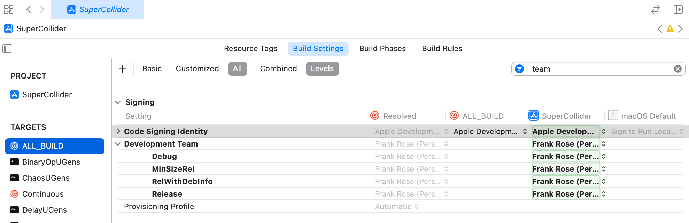

[](https://clojars.org/overtone/scsynth) [](https://clojars.org/overtone/scsynth-extras)

# This repository hosts the native os-specific library files of libscsynth and sc-plugins for overtone

Linux notes:
libscsynth needs libsndfile which in turn needs ogg/flac etc,
java-jna and java-jni can only provide shared libraries that they
load themselves. To help jna to load libscsynth, other than loading
each .so file individually, to set rpath to libscsynth and libsndfile,
this will work fine and in parallel to LD_LIBRARY_PATH.
JACK(libjack) still needs to be installed.

```
patchelf --set-rpath native/linux/x86_64 native/linux/x86_64/libsndfile.so.1
patchelf --set-rpath native/linux/x86_64 native/linux/x86_64/libscsynth.so
patchelf --set-rpath native/linux/x86_64 native/linux/x86_64/plugins/DiskIO_UGens.so

# scsynth-extras files:
patchelf --set-rpath native/linux/x86_64 native/linux/x86_64/plugins/PitchDetection.so
patchelf --set-rpath native/linux/x86_64 native/linux/x86_64/plugins/NCAnalysisUGens.so

```

NixOs notes:
if you're running on NixOs, you'll most likely encounter
```
java.lang.UnsatisfiedLinkError: libjack.so.0: cannot open shared object file: No such file or directory
```
you'll need to install libjack globally
```
nix-env -i libjack2
```
then and add your user-local lib directory to LD_LIBRARY_PATH (for example in ~/.bashrc)
```
export LD_LIBRARY_PATH=~/.nix-profile/lib:$LD_LIBRARY_PATH
```

patchelf useage:
  --set-rpath <rpath> <file-location>
  --set-soname <new-soname> <file-location>
  --replace-needed <new-dep-name> <old-dep-name> <file-location>

## macOS Build Notes
__The objective is to build the libscsynth*.dylib binaries to update the contents of resources/native/macosx/__

> NOTE: This is the sequence of steps I had to take to successfully build. Surely it can be improved. Feedback appreciated.

> TODO: Build ARM versions for Apple processors.

**Step 1**: Install tools per [macOS SuperCollider instructions](https://github.com/supercollider/supercollider/blob/develop/README_MACOS.md#prerequisites)

**Step 2**: Clone the repo:
```
git clone --recursive https://github.com/overtone/scsynth.git
```
**Step 3**: Configure makefiles.
> Note that `-DSC_IDE=OFF` and `-DSC_QT=OFF` do not currently work, so we can't avoid attempting to build the App.
```
mkdir build
cd build
cmake -G Xcode -D SC_ABLETON_LINK:BOOL=OFF -DSUPERNOVA:BOOL=ON -DLIBSCSYNTH:BOOL=ON -D CMAKE_PREFIX_PATH=`brew --prefix qt@5`  ..
```
**Step 4**: Resolve signing errors.

If you tried to build right now, you'd get a warning about being unable to build with missing identity.
```
error: An empty identity is not valid when signing a binary for the product type 'Command-line Tool'. (in target 'FFT_UGens' from project 'SuperCollider')
** BUILD FAILED **
```
To resolve, open the project in Xcode and assign a developer identity.
```
open ./SuperCollider.xcodeproj
```
Navigate to this view and assign a developer identity and team to all builds in the project.


> TODO: figure out how to do this from the command line

Close Xcode.

**Step 5**: Build using the makefiles just prepared.
```
cmake --build . --target install --config RelWithDebInfo
```
The build will fail because there's no signing identity for the app. But we don't need the app - we just need the libscsynth.*dylib files, which are here:
```
$ find . -name "libscsyn*dylib" -exec ls {} \;
./server/scsynth/RelWithDebInfo/libscsynth.1.0.0.dylib
./server/scsynth/RelWithDebInfo/libscsynth.dylib
./server/scsynth/RelWithDebInfo/libscsynth.1.dylib
```
**Step 6**: Copy the build products to the `resources/native/macosx/x86_64` foldert.
```
cp ./server/scsynth/RelWithDebInfo/*.dylib ../resources/native/macosx/x86_64
```
